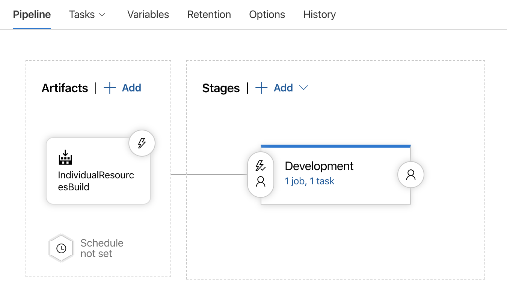
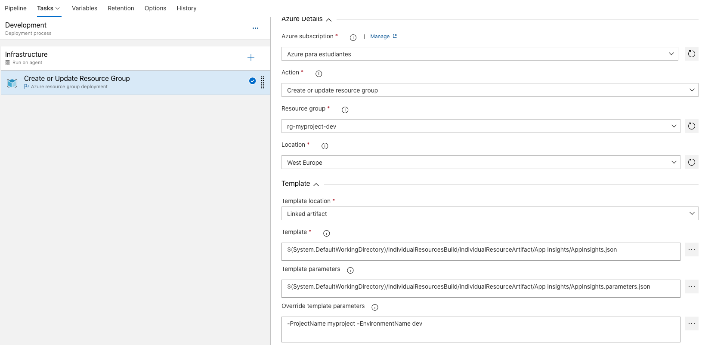

# Storage Account v2

## Informacion
Para desplegar el servicio de Azure Storage Account v2 se ha utilizado la plantilla [AppInsights.json](AppInsights.json) y han sido necesarios los parámetros definidos en [AppInsights.parameters.json](AppInsights.parameters.json).

## Despliegue
Un flujo ejemplo de despliegue en VSTS sería el siguiente:

### Release-Pipeline
>Se enlaza el artefacto generado con los ficheros AppInsights.json & AppInsights.parameters.json
>

### Release-Task
>Se añade una tarea de despliegue de grupo de recursos y se selecciona los ficheros del artefacto.
>

### Release-Variables
>Se sustituyen los parámetros definidos en AppInsights.parameters.json para adaptar el despliegue a nuestro entorno.
>
