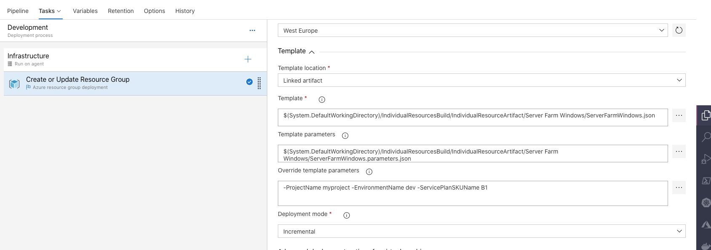
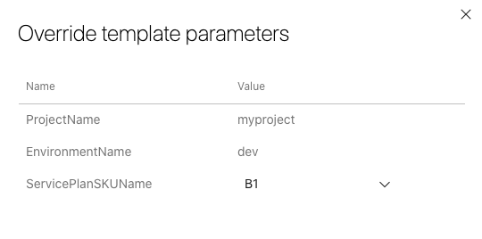

# Server Farm

## Informacion
Para desplegar el servicio de Server Farm o Service Plan  se ha utilizado la plantilla [ServerFarmWindows.json](ServerFarmWindows.json) y han sido necesarios los parámetros definidos en [ServerFarmWindows.parameters.json](ServerFarmWindows.parameters.json).

## Despliegue
Un flujo ejemplo de despliegue en VSTS sería el siguiente:

### Release-Pipeline
>Se enlaza el artefacto generado con los ficheros storageaccount.json & storageaccount.parameters.json
>

### Release-Task
>Se añade una tarea de despliegue de grupo de recursos y se selecciona los ficheros del artefacto.
>

### Release-Variables
>Se sustituyen los parámetros definidos en storageaccount.parameters.json para adaptar el despliegue a nuestro entorno.
>
